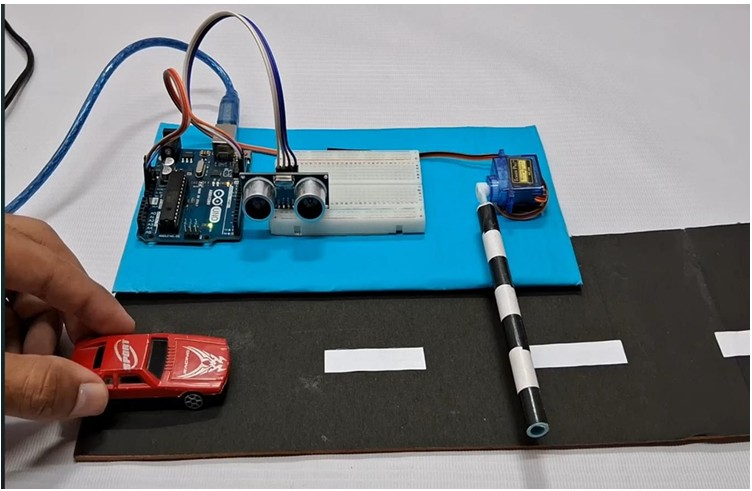

# Automatic Toll Gate System Using Arduino

## Project Overview

An Arduino-based automatic toll gate system that detects the presence
of a vehicle using an ultrasonic sensor and automatically controls
the gate using a servo motor.

## Components Used

- Arduino UNO
- HC-SR04 Ultrasonic Sensor
- Servo Motor
- Breadboard
- Jumper Wires

## Working

The ultrasonic sensor detects the presence of a vehicle by measuring
the distance from the sensor.

When a vehicle is detected within the defined 25 cm threshold, the
Arduino controls the servo motor to operate the gate.

When the vehicle moves away, the servo returns the gate to its
previous position.

## Technologies

- Arduino
- Embedded C/C++
- Ultrasonic Sensing
- Servo Motor Control

## Features

- Automatic vehicle detection
- Automatic gate operation
- Real-time distance measurement
- Simple and low-cost prototype

## Applications

- Parking lots
- Residential complexes
- Office buildings
- Shopping malls
- Event venues

## Project Image

